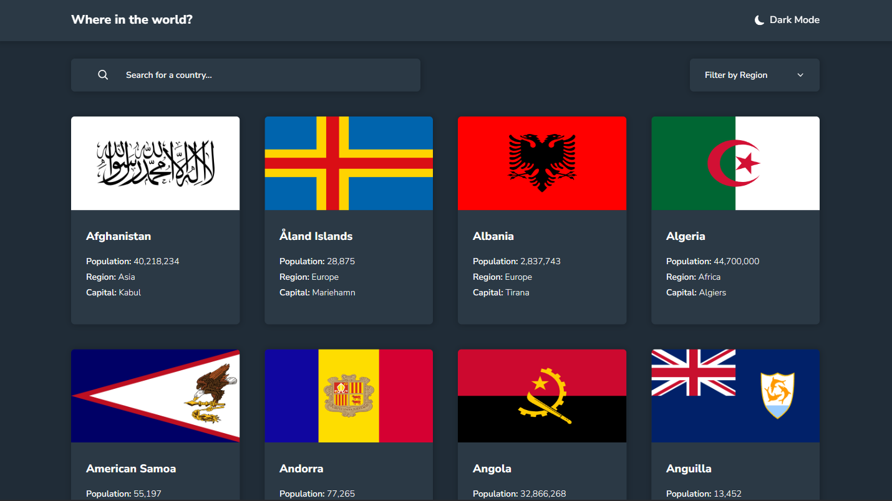
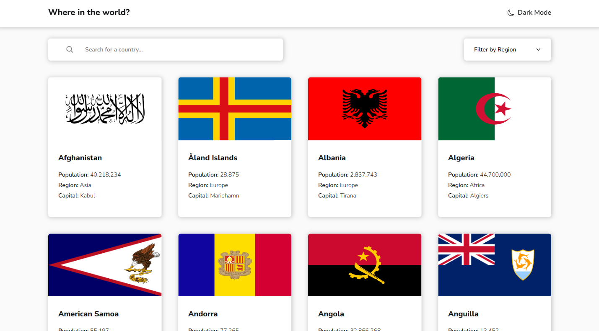

# REST Countries API

This is a React application that provides information about different countries using the REST Countries API.

## Screenshots

<!-- 
_Dark Theme_

_Light Theme_ -->

## Live Site

Check out the live site [here]().

## Features

- View a list of countries
- Click on a country to view detailed information
- Search for a specific country by name
- Filter countries by region
- Choose between dark and light themes for a personalized experience

## Tech Stack

The project is built using the following technologies:

- React: A JavaScript library for building user interfaces.
- Vite: A build tool that provides fast and efficient development and production builds for modern web applications.
- React Router: A library for routing in a React application, enabling navigation between different pages.
- Tailwind CSS: A utility-first CSS framework that enables rapid UI development with pre-defined styles and components.

## Installation and Usage

- Clone the repository: `git clone `
- Navigate to the project directory: `cd rest-countries-api`
- Run `npm install` to install project dependencies.
- Run `npm run dev` to start the development server.
- Open your browser and visit `http://localhost:3000` ((or the specified port)) to view the application.

## Folder Structure

- `src`: Contains the source code of the React application.
  - `components`: Contains reusable React components used throughout the application.
  - `pages`: Contains individual page components that are rendered based on routing.
  - `App.jsx`: Main component that sets up the application routing and theme.
  - `index.css`: Contains Tailwind directives and custom styles for the application.
  - `index.jsx`: Entry point of the application.

## Deployment

To deploy the application to production, run `npm run build`. This will create an optimized build in the dist folder, which can be deployed to a web server or hosting service of your choice.

## Contributing

Contributions to the project are welcome! Feel free to open issues and pull requests for bug fixes, improvements, or new features.

## License

This project is licensed under the [MIT License](LICENSE).
